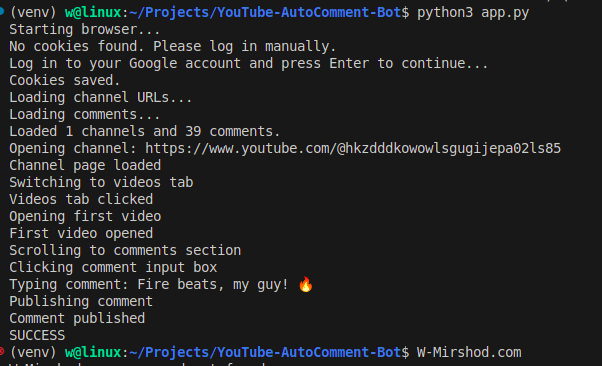
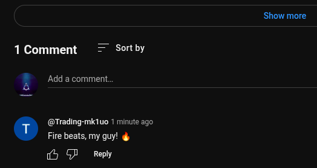

# 🔴 YouTube Auto Commenting Bot

## 📊 Natijalar



**Eslatma**: Natijalar tasvirida bot tomonidan qoldirilgan kommentariyalar va ularning muvaffaqiyatli joylanganligini ko'rishingiz mumkin.

## Umumiy ma'lumot
YouTube Avto Kommentariya Bot — YouTube videolariga avtomatik kommentariya qoldiruvchi Python skripti.

## 🌟 Xususiyatlar
- **Avto kommentariya**: Bot YouTube kanallaridagi videolarga avtomatik kommentariya qoldiradi.
- **Tasodifiy tanlash**: Foydalanuvchi taqdim etgan kommentariyalardan tasodifiy tanlab joylaydi.
- **Cookie ishlatish**: Google akkauntga kirish uchun cookie'larni ishlatadi.
- **Bir nechta kanal**: Bir vaqtning o'zida bir nechta kanalni qo'llab-quvvatlaydi.

## ❗ Muhim ❗
1. Bot faqat kanalning eng so'nggi videosiga kommentariya qoldiradi.
2. Kommentariyalar faqat harflar, raqamlar, "!", "?" va emoji'lardan iborat bo'lishi kerak. `comments.txt` faylida bo'sh qatorlar bo'lmasligi shart!

## 💻 Foydalanish
1. Pythonni o'rnatish.
2. Virtual muhit (venv) yaratish:
  ```bash
  python -m venv venv
  ```
3. Virtual muhitni faollashtirish:
  - Windows:
    ```bash
    venv\Scripts\activate
    ```
  - macOS/Linux:
    ```bash
    source venv/bin/activate
    ```
4. `pip install -r requirements.txt` buyrug'ini bajaring.
5. `channel_urls.txt` va `comments.txt` fayllarini tayyorlang.
6. `python app.py` buyrug'i bilan skriptni ishga tushiring.
7. Google akkauntingizga kiring va botni boshlang.

## ⚙️ Sozlash
- Kommentariya qoldiriladigan kanallarni `channel_urls.txt` faylida belgilang.
- `comments.txt` faylida kommentariyalarni qo'shing yoki o'chiring.
